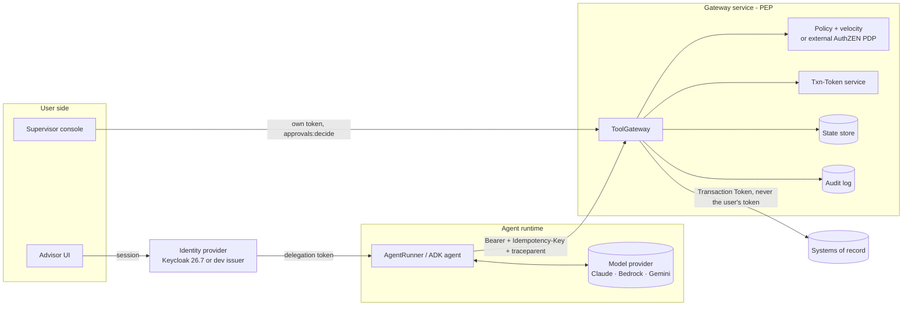

# Architecture

This note explains how a request flows through the reference build, why each control is there, and
which published standard or pattern it follows. External sources were re-checked on
**26 September 2026**; see [Standards currency](#standards-currency) for versions and status. A
kill switch, field-level minimisation, a signed audit checkpoint, per-exchange audience narrowing
(dev profile), DPoP sender-constrained tokens and an MCP JSON-RPC transport landed after that date
and are described from the code itself, not a freshly re-checked external source — called out
explicitly wherever that distinction matters.

## Deployment view



The agent runtime holds only a delegation token and the gateway URL. It has no backend credentials,
no policy, and no way to mint tokens. The gateway holds public keys for access tokens, its own
Transaction Token key, policy, state, and backend access. Backends accept only calls that carry a
valid, operation-bound Transaction Token, so a caller that bypasses the gateway is refused.

The live demo (`govagent demo-stack`, or `./scripts/run-demo.sh`) runs the Advisor UI, Supervisor
console and a dev identity provider as one small web app with no backend access of its own — every
action still goes over HTTP to a real, separately-running gateway process, so what the demo shows
is the actual enforcement path, not a mock of it.

The gateway also serves an MCP (2026-07-28) JSON-RPC transport (`POST /mcp`) alongside the REST API
above. It is a thin translation layer over the exact same `ToolGateway`/`TokenVerifier` objects the
REST routes use — one enforcement path, not a second implementation that can drift from the first.
An auth failure on either transport is the identical HTTP 401/403 with the identical challenge
header, which is the property that actually matters here, more than the wire format on top of it.

## Identity with Keycloak

With `--idp keycloak` the tokens come from a real OAuth 2.0 authorization server. Two OAuth clients,
as a production deployment would have:

| Client | Grant | Gets | Used for |
| --- | --- | --- | --- |
| `advisor-console` (the web app) | Authorization code + PKCE (S256) | The person's token: `aud` = agent client + gateway, scopes = the person's role | Supervisor approvals, compliance audit view; the subject token for exchange |
| `advisor-assist-agent` (the agent runtime) | RFC 8693 token exchange only | Per run: `aud` = gateway only, scopes narrowed to the agent's tools, `act` = the agent, 5-minute life | Every tool call |

```mermaid
sequenceDiagram
  participant P as Person (browser)
  participant C as Console
  participant K as Keycloak
  participant A as Agent runtime
  participant G as Gateway
  P->>K: sign in (Keycloak login page)
  K-->>C: code, then token (aud: agent, gateway)
  A->>K: token exchange (subject_token = person's token, scope = agent tools)
  K-->>A: token (aud: gateway, act: agent, at+jwt, EdDSA)
  A->>G: tool call with that token
  G->>K: JWKS (cached; refetched on unknown kid)
  G->>G: verify, then role and client book from the directory
```

How the gateway reads a Keycloak token (`OIDC_PROFILE` in `identity.py`):

- Same cryptographic checks as before: `typ=at+jwt` header, EdDSA only, known `kid`, `iss`, `aud`,
  `exp`, and also Keycloak's payload `typ=Bearer`, which rejects ID and refresh tokens.
- Person = `preferred_username`. Role and client book come from the directory (the system of record),
  and token scopes are intersected with the role's scopes.
- Agent = `act.sub`, which must equal `azp`. Tool calls need a delegated token (with `act`) from a
  registered agent client, so a person's own console token cannot call tools.
- Run = the token id. Each run gets a fresh exchanged token, so closing the run retires that token.

What Keycloak does and does not do here, checked against the 26.7.4 documentation and source:

- Standard token exchange (V2) is supported and on by default; the requesting client must be
  confidential and must appear in the subject token's `aud`.
- By default an exchange may **add** optional scopes. The realm applies the
  `downscope-assertion-grant-enforcer` client policy so it can only narrow them.
- Client scopes with role mappings are issued only to users holding one of those roles; this is how
  scopes follow roles.
- Keycloak does not emit `act` for delegation to a client (26.7 has an experimental user-to-admin
  `may_act` only). The realm adds `act` with a hardcoded-claim mapper in a default client scope
  (`agent-actor`), so it is still asserted by the authorization server, and the gateway checks it
  against `azp`. It has to be a scope, not a client-level mapper: during a downscope-only exchange
  Keycloak filters the client's own mappers out (`DefaultClientSessionContext.isAllowed`), which an
  independent review of the 26.7.4 source caught before release.
- The `resource` parameter (RFC 8707) is not supported yet; the gateway's resource id is added as a
  custom audience by a client scope instead.
- Revoking the person's token does not revoke exchanged access tokens (Keycloak documents this), so
  agent tokens are short-lived and the gateway keeps its own revocation list and run binding.

## Multi-agent delegation

In multi-agent mode an orchestrator plans and each part goes to a specialist. Each hop is a token
exchange, so every agent holds its own, narrower token, and the chain is recorded in nested `act`
claims (RFC 8693 §4.1):

```
person's token            aud: agents + gateway      scopes: the person's role
  └─ orchestrator-agent   aud: gateway + specialists  act: {sub: orchestrator-agent}       tools: none
       └─ payments-agent  aud: gateway                act: {sub: payments-agent,
                                                            act: {sub: orchestrator-agent}} scopes: payments:initiate
```

The gateway checks two things on every call, and both must allow it:

- **The token** (what the person allowed): scopes, audience, run, entitlement, as before.
- **The agent registry** (`policies/agents.yaml`, what this agent is for): the acting agent may use
  this tool; each link in the chain may delegate to the next; the chain is no deeper than 2. A comms
  agent hijacked into requesting a wire is stopped here even though the person could wire.

The orchestrator has no tools, so it cannot act directly. A specialist cannot skip it: its client is
not in the audience of the person's token, so Keycloak refuses that exchange. The orchestrator's final
answer is checked against what the gateway decided for every specialist.

In the dev profile, every issued and exchanged token now also carries the acting agent's own id as
a second audience value — `[gateway, "payments-agent"]`, not just `[gateway]` — so one specialist's
token is no longer indistinguishable from another's by audience alone. This closes the gap stated
below for the Keycloak path, but only there: it is checked at `TokenVerifier.verify()`, gated to the
dev profile specifically, because Keycloak's own realm config already narrows audience its own
(different, forward-looking) way, described next.

Limits, stated plainly: in Keycloak the inner link of the chain (`act.act`) is set by realm
configuration, not copied from the subject token, and every orchestrator token lists all three
specialists as audience, so any specialist could exchange it, though only for its own scopes.
Sending an `audience` parameter per exchange would narrow that further; it remains on the roadmap
for the Keycloak path specifically.

## Agent harness

`harness/runtime.py` is the runtime around the model, the same for every agent. It owns budgets
(steps, tool calls, wall-clock time), retries with backoff on transient model errors, a timeout per
tool call (late results are waited for before the run closes, so the record is complete),
context trimming, and a check of the final answer against what the gateway actually did (a hijacked
model saying "done" gets a correction). It owns no permissions: every side effect is the gateway's
decision, and the harness cannot tell a local gateway from a remote one.

## Telemetry

Every hop emits OpenTelemetry spans: console, orchestrator, `invoke_agent`, `chat {model}`,
`execute_tool`, the identity provider's token exchange, each gateway check, and the backend call.
Names follow the OpenTelemetry GenAI semantic conventions (still marked "development" upstream).
Context crosses processes in the W3C `traceparent` header. Spans go to an in-memory store for the
built-in trace view, and to any OTLP collector (Jaeger in the demo) when
`OTEL_EXPORTER_OTLP_ENDPOINT` is set; Keycloak's own spans join the same trace when tracing is on.
Spans carry scopes, client ids and decisions, never tokens. The token inspector shows decoded claims
and a truncated preview; raw tokens stay on the server.

## Request flow

Example: an advisor asks for a $12,000 wire from C-1001's brokerage account to beneficiary B-2001.

```mermaid
sequenceDiagram
  participant U as Advisor
  participant I as IdP
  participant R as Agent runtime
  participant M as Model
  participant G as Gateway
  participant S as Supervisor
  participant B as Backend
  U->>I: start agent session
  I-->>R: JWT (sub=advisor, act=agent, aud=gateway, run=run-123)
  R->>M: request + tool list
  M-->>R: tool_use initiate_wire_transfer
  R->>G: POST /v1/tools/.../invoke (Bearer, Idempotency-Key, traceparent)
  G->>G: checks 1-15
  G-->>R: 202 pending_approval (action act-9)
  R->>M: tool result: pending
  M-->>R: "Submitted for approval; not sent yet"
  R->>G: GET /v1/actions/act-9 (poll, like an MCP task)
  S->>G: POST /v1/approvals/act-9/decision (own token)
  G->>G: four-eyes, authority, expiry, re-validate
  G->>B: create wire + Transaction Token (txn=act-9, scope=tool, args hash)
  B-->>G: W-0001 pending release
```

Gateway checks, in order (`pipeline.py:STAGES`, the single source of truth the pipeline view and the
token inspector both read). The first failure stops the request. This table previously omitted its
own stage 5 (agent registry) despite it being described in [Multi-agent delegation](#multi-agent-delegation)
above; it is corrected here, alongside the two stages added since.

| # | Check | What it stops |
| --- | --- | --- |
| 1 | Kill switch: global, per-tool or per-agent stop, checked ahead of identity by reading the token's own unverified `act` claim (safe: a stop can only add a restriction, never grant one — a forged token still fails identity right after) | A compromised or misbehaving agent or tool, stopped immediately, independent of whether its token is otherwise valid |
| 2 | Token: `typ=at+jwt`, `alg` pinned, known `kid`, `iss`, `aud`, `exp/nbf`, revocation, actor, and — only for a token carrying `cnf.jkt` — a matching DPoP proof (signature, key binding, method/URL match, freshness, replay) | Forged, expired, revoked or misdirected tokens; for a DPoP-bound token, a stolen bearer string used by anyone but the key holder it was bound to |
| 3 | Run binding: run id from the token; closed runs and foreign runs refused | Replaying a finished run's token; budget resets |
| 4 | Registry | Hallucinated or unregistered tools |
| 5 | Agent allowed (agent registry: `policies/agents.yaml`) | An agent reaching for a tool it is not for; a hijacked specialist overstepping its delegation |
| 6 | Schema | Malformed arguments |
| 7 | Masked fields resolved: a value the model only ever saw masked (`"****5678"`) is resolved against the system of record before anything downstream sees it | A model echoing back a value it was never shown in full |
| 8 | Idempotency key (side-effecting tools) | Duplicate side effects on retry |
| 9 | Scope (403 `insufficient_scope` challenge over HTTP) | Actions outside the role or narrowed token |
| 10 | Entitlement | Clients outside the human's book |
| 11 | Risk ceiling | Tools above this agent's tier |
| 12 | Run budgets | Looping agents |
| 13 | Policy, with facts from systems of record (local engine or AuthZEN PDP) | Out-of-policy actions, including a hijacked model's |
| 14 | Velocity, reserved atomically | Splitting one action across many runs; parallel requests |
| 15 | Durable approval (pollable, expiring) | High-impact actions without a human |
| 16 | Re-validation at execution | Changes between request and approval |
| 17 | Execute with idempotency key and a Transaction Token; the circuit breaker is checked here too, refusing a tool with too many recent backend errors without reaching the backend at all | Backend duplicates; bypassing the gateway; in-flight tampering; a cascade of calls to a backend that is already failing |
| 18 | Output: field-level allowlisting/masking of the result, then an injection scan | Fields the model was never meant to see at all; account numbers and similar beyond their masked form; instruction-like content reaching the model unmarked |

Every stage writes to the hash-chained audit log, with W3C trace context carried alongside. A
periodic signed checkpoint (EdDSA, the same `kid` machinery as tokens) binds an evidence pack's
`summary.json` to an exact, tamper-evident audit head, so a later edit to the log — or a pack
assembled from two different runs' files — is detectable, not merely internally self-consistent.
Write-once storage for the log itself remains on the roadmap.

## Standards currency

Checked 26 September 2026. RFCs do not expire; drafts and industry lists do.

| Source | Version used | Status on 26 Sep 2026 |
| --- | --- | --- |
| [MCP specification](https://modelcontextprotocol.io/specification/versioning) | **2026-07-28** (current) | Replaced 2025-11-25 and 2025-06-18. Stateless protocol, tasks moved to an extension, scope-challenge handling, RFC 9207 on the client side. The JSON-RPC transport added here (`POST /mcp`: `initialize`, `tools/list`, `tools/call`, `tasks/get`) is this reference build's own mapping onto that extension's mechanism, written without a live copy of the 2026-07-28 tasks-extension text to check exact field names against — demonstrates the mechanism honestly, not a certified implementation of it |
| [OAuth 2.1](https://datatracker.ietf.org/doc/draft-ietf-oauth-v2-1/) | draft-16, 3 Sep 2026 | Active draft; MCP still cites draft-13 |
| [Transaction Tokens](https://datatracker.ietf.org/doc/draft-ietf-oauth-transaction-tokens/08/) | draft-08, Mar 2026 | IETF working-group last call |
| [Txn-Tokens for Agents](https://datatracker.ietf.org/doc/html/draft-oauth-transaction-tokens-for-agents-04) | draft-04, Feb 2026 | Individual draft; followed in spirit only |
| [OpenID AuthZEN Authorization API 1.0](https://openid.net/authorization-api-1-0-final-specification-approved/) | 1.0 | **Final** specification, approved 12 Jan 2026 |
| [Idempotency-Key header](https://datatracker.ietf.org/doc/draft-ietf-httpapi-idempotency-key-header/) | draft-07 | **Expired**, no successor. Still the most-cited reference; used as a pattern, not a standard |
| [OWASP Top 10 for LLM Applications](https://genai.owasp.org/resource/owasp-genai-llm-top-10-2026/) | **2026** (3 Aug 2026) | Excessive Agency moved from LLM06 (2025) to **LLM03:2026** |
| [OWASP Top 10 for Agentic Applications](https://genai.owasp.org/resource/owasp-top-10-for-agentic-applications-for-2026/) | 2026 (9 Dec 2025) | Current |
| [FINRA 2026 Regulatory Oversight Report](https://www.finra.org/sites/default/files/2025-12/2026-annual-regulatory-oversight-report.pdf) | Dec 2025 | Current; has an AI-agents section (p. 27) |
| [Keycloak](https://www.keycloak.org/securing-apps/token-exchange) | **26.7.4** | Current release. Standard token exchange V2 supported; token exchange delegation experimental; RFC 9068 `at+jwt` header option since 26.2; EdDSA keys since 24 |
| [NIST AI Agent Standards Initiative](https://www.nist.gov/artificial-intelligence/ai-agent-standards-initiative) | Launched 17 Feb 2026 | RFI and NCCoE concept paper on agent identity and authorization; no final NIST publication yet |
| RFC 6750, 7519, 8693, 8707, 8725, 9068, 9207, 9449, 9728; NIST SP 800-207; CWE-367 | as published | Stable |

The OWASP 2026 LLM list page could not be read directly (bot protection). The ranking above is
confirmed by two independent write-ups
([Invicti](https://www.invicti.com/blog/web-security/owasp-llm-top-10-2026-whats-new),
[Security Boulevard](https://securityboulevard.com/2026/09/owasp-llm-top-10-2026-every-move-points-the-same-direction/)).

## Control-to-standard mapping

| Control | Pattern or standard | Where |
| --- | --- | --- |
| Delegation, not impersonation | OAuth 2.0 Token Exchange, `act` claim — [RFC 8693](https://www.rfc-editor.org/rfc/rfc8693.html) §1.1, §4.1; performed by Keycloak in `--idp keycloak` mode | `identity.py`, `demo/oidc.py`, realm file |
| Person signs in; code cannot be intercepted | Authorization code with PKCE — [RFC 7636](https://www.rfc-editor.org/rfc/rfc7636.html); no password grant, per [OAuth 2.1](https://datatracker.ietf.org/doc/draft-ietf-oauth-v2-1/) | `demo/oidc.py`, realm file |
| Public keys from the issuer | JWKS discovered via [RFC 8414](https://www.rfc-editor.org/rfc/rfc8414.html) / OIDC discovery, issuer must match exactly | `JwksKeySource`, `OidcIdp.discover` |
| Access-token format | JWT access-token profile, `typ=at+jwt` — [RFC 9068](https://www.rfc-editor.org/rfc/rfc9068.html) §2, §4 | `identity.py` |
| Algorithm pinning, issuer and audience checks | [RFC 8725](https://www.rfc-editor.org/rfc/rfc8725.html) §3.1, §3.8, §3.9 | `TokenVerifier` |
| Audience-bound tokens; no passthrough; 401 / 403 with challenges | [MCP authorization, 2026-07-28](https://modelcontextprotocol.io/specification/2026-07-28/basic/authorization); [RFC 8707](https://www.rfc-editor.org/rfc/rfc8707.html); [RFC 6750](https://datatracker.ietf.org/doc/html/rfc6750) §3.1; [RFC 9728](https://www.rfc-editor.org/rfc/rfc9728.html) | `service.py` |
| Sender-constrained tokens, opt-in via `cnf.jkt` | [DPoP, RFC 9449](https://www.rfc-editor.org/rfc/rfc9449.html) — proof signature, key binding, `htm`/`htu` match, freshness, `ath`, `jti` replay; §7.1 challenge on failure | `dpop.py`, `identity.py` (`TokenVerifier`), `gateway.py`, `service.py`, `remote.py` |
| MCP JSON-RPC transport alongside the REST API, same enforcement path | [MCP Streamable HTTP, 2026-07-28](https://modelcontextprotocol.io/specification/2026-07-28/basic/transports) | `service.py` (`POST /mcp`) |
| Gateway-to-backend identity | [Transaction Tokens draft-08](https://datatracker.ietf.org/doc/draft-ietf-oauth-transaction-tokens/08/): `typ=txntoken+jwt`, `txn`, `sub`, `scope`, `req_wl`, `tctx`, lifetime of minutes or less | `txn.py`, backend |
| PEP / PDP split | [NIST SP 800-207](https://nvlpubs.nist.gov/nistpubs/SpecialPublications/NIST.SP.800-207.pdf) §3; PDP API per [AuthZEN 1.0](https://openid.github.io/authzen/) (`/access/v1/evaluation`, `/.well-known/authzen-configuration`) | `service.py`, `pdp.py` |
| Pending approval as a pollable handle | Mirrors the MCP tasks extension (`tasks/get` polling) in the [2026-07-28 changelog](https://modelcontextprotocol.io/specification/2026-07-28/changelog) | `GET /v1/actions/{id}` |
| Trace context | W3C `traceparent`, as MCP 2026-07-28 documents for `_meta` | gateway, Txn-Token `rctx` |
| Idempotency keys; 400 / 409 / 422 | [draft-ietf-httpapi-idempotency-key-header-07](https://datatracker.ietf.org/doc/html/draft-ietf-httpapi-idempotency-key-header-07) (expired); [Stripe-style design](https://brandur.org/idempotency-keys) | gateway, backend |
| Re-validate at execution | [CWE-367](https://cwe.mitre.org/data/definitions/367.html) time-of-check/time-of-use | `ToolGateway.decide` |
| Cross-run limits | Splitting to stay under thresholds is the pattern behind structuring, [31 U.S.C. §5324](https://www.law.cornell.edu/uscode/text/31/5324); our $50,000 is an internal limit | `velocity.py` |

## OWASP 2026 coverage

**LLM Top 10 (2026).** Excessive Agency (now **LLM03:2026**) is the risk this build is about.
The [2025 page](https://genai.owasp.org/llmrisk/llm062025-excessive-agency/) listed the mitigations
we implement: minimise extensions and permissions, execute in the user's context, require user
approval, complete mediation, and rate limiting. Prompt Injection (LLM01) is contained, not
prevented: injected text is flagged, and authorization never depends on the model.
Sensitive Information Disclosure (LLM02) is better covered than before: log redaction, plus
field-level minimisation of what the model is shown at all (`ToolSpec.returns`/`mask`, gateway
stage 18) — an account id is masked before the model ever sees it, not only in the final answer.

**Top 10 for Agentic Applications (2026)** — IDs and names as summarised by
[Auth0](https://auth0.com/blog/owasp-top-10-agentic-applications-lessons/):

| ID | Risk | Coverage here |
| --- | --- | --- |
| ASI01 | Agent Goal Hijack | Policy on system-of-record facts, approvals, run-bound tokens (`ctl-injection-hijack`) |
| ASI02 | Tool Misuse & Exploitation | Registry, schema, scope, velocity, asynchronous approval |
| ASI03 | Identity & Privilege Abuse | Delegation tokens, task-narrowed scopes, entitlement, revocation, opt-in DPoP sender-constraining (RFC 9449) |
| ASI04 | Agentic Supply Chain | Partial: fixed tool registry; no dependency or model provenance checks |
| ASI05 | Unexpected Code Execution | Not applicable: no code-execution tools |
| ASI06 | Memory & Context Poisoning | Partial: injection flagging on tool output; no long-term memory in scope |
| ASI07 | Insecure Inter-Agent Communication | Partial: orchestrator and specialists each hold an exchanged token with the chain in `act`; agent registry enforced at the gateway; dev-profile tokens also carry the acting agent's own id as audience, so one specialist's token no longer looks identical to another's. No A2A protocol or cross-organisation agents; Keycloak-profile audience narrowing remains realm-config-level, not per-exchange |
| ASI08 | Cascading Failures | Budgets, fail-closed PDP, idempotency, a per-tool circuit breaker (open/half-open/closed on repeated backend errors) |
| ASI09 | Human-Agent Trust Exploitation | Four-eyes, approver authority, "not sent yet" wording tested in evals |
| ASI10 | Rogue Agents | Revocation by token or subject, closed runs, a global/per-tool/per-agent kill switch checked ahead of identity, `GET /v1/metrics` for stop and breaker state |

## FINRA 2026 agent considerations

The [2026 Regulatory Oversight Report](https://www.finra.org/sites/default/files/2025-12/2026-annual-regulatory-oversight-report.pdf)
(p. 27) lists agent risks and asks firms how they will monitor, oversee, track and constrain agents.

| FINRA consideration | How this build answers it |
| --- | --- |
| Autonomy without human validation | Durable approvals with four-eyes and re-validation |
| Scope and authority | Scopes, entitlements, risk ceiling, velocity, deny-by-default policy |
| Auditability and transparency | Hash-chained audit with a periodic signed checkpoint, trace context, evidence pack (ABOM, authority, traces, a provenance block binding the pack to an exact audit head) |
| Data sensitivity | Log redaction, and field-level minimisation of what reaches the model at all (allowlisted/masked results), not only the final answer |
| "How to track agent actions and decisions" | Per-run call records, audit events, pollable actions |
| "Guardrails or control mechanisms to limit agent behaviors" | The gateway itself |

## Threats and where they are stopped

| Threat | Stopped by |
| --- | --- |
| Prompt injection makes the model request a large wire to an attacker | Policy with system-of-record facts (#13); approval (#15) |
| Same wire split into many smaller runs | Velocity (#14) |
| Two wires requested in parallel while approval is pending | Reservations counted in velocity (#14) |
| Beneficiary removed or advisor offboarded while approval waits | Re-validation (#16) |
| Network retry creates a second wire | Idempotency (#8, #17) |
| Stolen token used against another service | Audience check (#2) |
| Stolen bearer token used by whoever holds it, not just against another service | DPoP sender-constraining (#2), opt-in per token |
| Stolen token replayed after the run | Run binding (#3), short TTL, revocation |
| Something calls the backend directly, skipping the gateway | Backend requires a gateway-minted Transaction Token (#17) |
| Amount changed between gateway and backend | Txn-Token binds the argument hash (#17) |
| A backend outage turns into a flood of failing calls | Circuit breaker opens after repeated errors, refuses without reaching the backend (#17) |
| A compromised agent or tool needs to be stopped immediately | Kill switch, checked ahead of identity (#1) |
| A masked value the model was shown gets echoed back as an argument | Resolved against the system of record before policy or execution see it (#7) |
| Agent runtime compromised | No backend credentials; cannot mint tokens; its OAuth client cannot obtain approval or audit scopes |
| Token exchange used to gain scopes | Keycloak downscope-only policy; gateway intersects scopes with the role |
| Person's console token used to call tools | Gateway accepts tool calls only from registered agent clients |
| Advisor approves own request | Four-eyes and approver scope (#15) |
| Audit record edited | Hash chain, plus a periodic signed checkpoint binding a pack to an exact head; write-once storage for the log itself is on the roadmap |

## Shipped since 26 September 2026

- ~~Runtime output guardrail on the final answer (PII, advice language), not only in evals.~~ Was
  already running by default in both the single-agent and orchestrator harness paths when checked —
  not newly built, just confirmed.
- ~~Field-level minimisation of what the model sees (LLM02:2026).~~ `ToolSpec.returns`/`mask`, a new
  gateway stage ("masked fields resolved") that resolves a value the model only saw masked against
  the system of record before policy or execution see it.
- ~~Anchoring the audit chain in a signed external checkpoint.~~ `AuditLog.checkpoint()` (EdDSA, the
  same `kid` machinery as tokens); the evidence pack's `summary.json` carries a `provenance` block
  bound to it. Write-once storage for the log itself is still open, below.
- ~~Metrics and alerting; a global kill switch; circuit breakers (ASI08, ASI10).~~ A
  global/per-tool/per-agent kill switch (checked ahead of identity), a per-tool circuit breaker
  (open/half-open/closed), and `GET /v1/metrics` (decisions by outcome and stage, approvals,
  breaker and stop state). Active alerting (paging, webhooks on a threshold) is not built —
  metrics are exposed, nothing pushes a notification yet.
- ~~Sender-constrained tokens (DPoP, [RFC 9449](https://www.rfc-editor.org/rfc/rfc9449.html)).~~
  Opt-in via a token's `cnf.jkt`; enforced at `/v1/tools/{name}/invoke` and `RemoteGateway.invoke()`.
  The other REST routes (`/v1/tools`, `/v1/authority`, `/v1/actions/{id}`, `/v1/runs/.../calls`)
  don't thread a proof through yet, so a DPoP-bound token should only be used for tool-invoke calls
  today. Not exercised against a live Keycloak instance.
- ~~A full MCP 2026-07-28 server surface... in front of the gateway.~~ `POST /mcp`: `initialize`,
  `tools/list`, `tools/call`, `tasks/get` — one translation layer over the identical
  gateway/verifier the REST routes use. The tasks vocabulary is this build's own mapping onto that
  extension's mechanism, not a certified implementation of its exact wire format.
- ~~Per-exchange `audience` narrowing.~~ Shipped for the dev profile: every issued/exchanged token
  carries the acting agent's own id as a second audience value. Keycloak's realm config narrows
  audience its own, different (forward-looking, not self-naming) way already; sending an explicit
  `audience` parameter per exchange on that path specifically remains open, below.

## Still out of scope (roadmap)

- Write-once storage for the audit log itself (the checkpoint above makes tampering *detectable*,
  not *impossible*).
- Active alerting on the metrics the kill switch and breaker now expose (paging, webhooks).
- DPoP proof enforcement on every REST route, not only tool-invoke; verification against a live
  Keycloak instance.
- Per-exchange `audience` narrowing on the Keycloak path specifically (the dev-profile path above is
  done; Keycloak's own, different convention is a separate, still-open gap).
- A2A protocol and agents from other organisations (ASI07).
- Red-team case generation (a mutation generator over injection payloads, a miner turning
  `gateway-audit.jsonl` denials into regression cases): considered and deliberately deferred — it
  would widen *detection* coverage (`scan_for_injection` exercises 1 of its own 4 known patterns
  today), not the *security boundary*, which already holds regardless of whether the flag fires.
- Repeated-trial evals.
- Tracking NIST's AI Agent Standards Initiative outputs as they are finalised.
