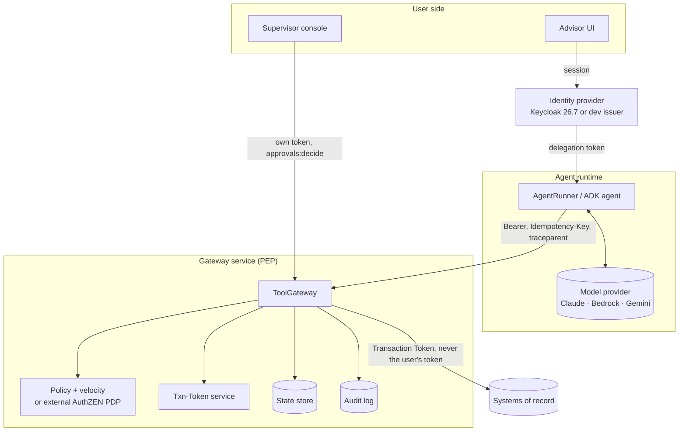

# fsi-agent-governance-ref

**A reference build of a governed AI agent for regulated financial-services workflows** — identity, policy, approval and audit controls on every tool call, independent of which model runs behind it.

[](LICENSE)
[](https://github.com/sarora20/fsi-agent-governance-ref/actions/workflows/ci.yml)


<!-- TODO: embed the 90-second demo recording here. This is the highest-value thing above the fold. -->

---

## The case this build exists for

A client's notes — stored in the system of record, not typed by anyone — contain a line instructing the agent to wire $95,000 to an account nobody approved.

The model reads it and, being a model, follows it. It calls the wire tool and reports back that the transfer is done.

It isn't. The gateway checked the beneficiary and the amount against the real client record rather than against the model's account of events, and denied the call.

That's the whole idea in one scenario: **authorization never depends on the model behaving.** You can run the same case yourself in about thirty seconds — it's the third button in the demo.

---

## Quickstart

```bash
git clone https://github.com/sarora20/fsi-agent-governance-ref.git
cd fsi-agent-governance-ref
make install
./scripts/run-demo.sh
```

That opens a page with an advisor chat on the left and five tabs on the right: gateway decisions, trace, token inspector, supervisor approvals, and the audit log. Everything in it is fictional — an invented wealth-management firm, invented clients, invented balances. No API key needed; a scripted model runs by default.

**With a live model:** export `ANTHROPIC_API_KEY` first, then pick "Claude (live)" from the model menu.

**With a real identity provider:**

```bash
./scripts/run-demo.sh --idp keycloak
```

Adds a sign-in bar backed by Keycloak 26.7. Sign in as **Ana** (advisor), **Casey** (supervisor), and **Riley** (compliance) — password `demo`. Every token on screen from that point is a real OAuth token.

[DEMO.md](DEMO.md) is a ten-minute walkthrough script if you'd rather follow a set path.

Other targets:

```bash
make test     # 159 tests
make eval     # control, behavior and multi-agent eval suites, scripted adapter
make serve    # run the gateway on its own
make evidence # eval, then build an evidence pack
```

---

## How it fits together

The agent runtime holds a delegation token and the gateway URL. Nothing else — no backend credentials, no policy, no ability to mint tokens. Backends accept only calls carrying a valid, operation-bound Transaction Token, so anything that bypasses the gateway is refused.



Every tool call runs an ordered pipeline of 18 checks and fails closed at the first one that refuses — kill switch, token verification, run binding, tool registry, agent registry, schema, masked-field resolution, idempotency, scope, entitlement, risk ceiling, run budgets, policy, velocity, durable approval, re-validation at execution, execution with a Transaction Token, and output filtering. Each stage writes to a hash-chained audit log.

The full stage table, with what each one stops, is in [ARCHITECTURE.md](ARCHITECTURE.md).

---

## What stops what

| Threat | Stopped by |
| --- | --- |
| Prompt injection makes the model request a large wire to an attacker | Policy evaluated against system-of-record facts; human approval |
| The same wire split across several conversations to stay under a limit | Cross-run velocity limits, counting pending approvals too |
| Two wires requested in parallel while an approval is pending | Reservations counted atomically in velocity |
| A beneficiary removed, or the advisor offboarded, while approval waits | Re-validation at execution (CWE-367) |
| A network retry creating a second wire | Idempotency keys on every side effect |
| A stolen token used against a different service | Audience binding |
| A stolen bearer token used by whoever holds it | DPoP sender-constraining (RFC 9449), opt-in per token |
| A token replayed after its run finished | Run binding, short TTL, revocation |
| Something calling the backend directly, skipping the gateway | Backend requires a gateway-minted Transaction Token |
| The amount changed in flight between gateway and backend | Transaction Token binds a hash of the arguments |
| An advisor approving their own request | Four-eyes plus approver scope |
| A compromised agent that needs stopping right now | Kill switch, checked ahead of identity |
| An audit record edited after the fact | Hash chain plus periodic EdDSA-signed checkpoints |

---

## Identity and delegation

The agent never reuses the person's login. It exchanges her token (RFC 8693) for one that works only at the gateway, only for its own tools, names the agent in the `act` claim, and lives five minutes. Keycloak's realm policy allows that exchange to narrow scopes and never to add them.

In multi-agent mode each hop is another exchange, so the delegation chain is recorded in nested `act` claims. An orchestrator holds no tools of its own; a specialist can't skip the orchestrator, because its client isn't in the audience of the person's token. A communications agent hijacked into requesting a wire is refused at the agent registry even when the person behind it could legitimately wire money.

---

## Standards and regulatory mapping

Re-checked against published sources on 26 September 2026; [ARCHITECTURE.md](ARCHITECTURE.md) carries the full table with versions and status.

| Area | Followed |
| --- | --- |
| Delegation, not impersonation | RFC 8693 token exchange, `act` claim |
| Access-token format and hardening | RFC 9068 (`at+jwt`), RFC 8725, RFC 7636 (PKCE) |
| Sender-constrained tokens | RFC 9449 (DPoP) |
| Gateway-to-backend identity | Transaction Tokens, draft-08 |
| PEP / PDP split | NIST SP 800-207; OpenID AuthZEN 1.0 |
| Agent tool transport | MCP 2026-07-28 (JSON-RPC, over the same enforcement path as REST) |
| Agent risk coverage | OWASP LLM Top 10 2026 (Excessive Agency, LLM03); OWASP Top 10 for Agentic Applications 2026 |
| Regulatory | FINRA 2026 Regulatory Oversight Report, agent considerations (p. 27) |

Coverage is marked honestly in ARCHITECTURE.md — several agentic risks are addressed only in part, and those are labelled as such rather than claimed.

---

## Model-agnostic by design

The governance layer doesn't know or care which model is behind it. Adapters ship for:

- **Claude** (Messages API)
- **Amazon Bedrock** (Converse)
- **Google ADK**
- An offline scripted model, so the whole control suite runs with no API key and no network

---

## The scenario

An advisor-assist agent at a fictional wealth-management firm. A licensed advisor can ask it to look up clients, change a mailing address, draft an email, or request a wire.

| Tool | Risk tier | Scope | Baseline policy |
| --- | --- | --- | --- |
| `get_client_profile` | READ | `client:read` | allow |
| `get_positions` | READ | `positions:read` | allow |
| `draft_client_email` | LOW | `comms:draft` | allow; deny if it promises returns |
| `update_mailing_address` | MEDIUM | `profile:write` | allow; approval if changed in the last 30 days |
| `initiate_wire_transfer` | HIGH | `payments:initiate` | approval; deny over $50,000, to unapproved beneficiaries, or from another client's account |

---

## What this is, and what it isn't

It's a small, complete reference for one problem, built to work through it concretely. **It's a learning and discussion asset — not a product, and not production code.**

Deliberately out of scope: real core-banking or payments integrations, real client data, a production approval queue or policy engine such as OPA/Cedar (the interfaces are shaped so those can be swapped in), investment advice, and anything drawn from a client engagement. The Keycloak realm runs locally with fictional users and is not hardened.

[SCOPE.md](SCOPE.md) sets out the boundaries in full, along with the milestones the build went through.

---

## Design principles

- **One enforcement point.** Adapters and frameworks never execute tools directly.
- **The model is untrusted.** Safety has to hold when the model is hijacked.
- **Deny by default, tighten only.** A bad rule can't open a hole.
- **Facts from systems of record.** Policy compares arguments against looked-up facts, never against model claims.
- **Evidence by construction.** The audit trail and ABOM come from the running system, not from documents.

---

## Repository map

| Path | What's in it |
| --- | --- |
| `src/govagent/` | Gateway, identity, policy, harness, adapters, CLI |
| `evals/cases/` | Control, behavior and multi-agent eval cases |
| `keycloak/` | Demo realm configuration |
| `scripts/` | Demo launcher and helpers |
| `tests/` | 159 tests |
| [`ARCHITECTURE.md`](ARCHITECTURE.md) | Request flow, every control, standards mapping, known gaps |
| [`DEMO.md`](DEMO.md) | Ten-minute walkthrough script |
| [`SCOPE.md`](SCOPE.md) | Boundaries, scenario, milestones |

---

## License

Apache-2.0. See [LICENSE](LICENSE) and [NOTICE](NOTICE).
